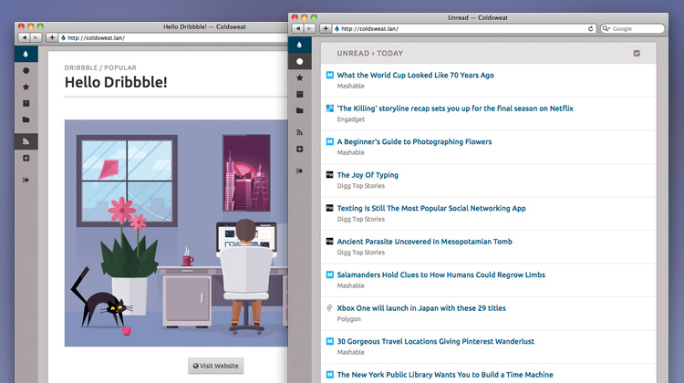

# About

Coldsweat is a Python web RSS aggregator and reader compatible with the [Fever API][f]. This means that you can connect Coldsweat to a variety of clients like [Reeder][r] for iOS or Mac OS X [ReadKit][rk] app and use it to sync them together.

## Motivation

I'm fed up of online services that are here today and gone tomorrow. After the Google Reader shutdown is clear to me that the less we rely on external services the more the data we care about are preserved. With this in mind I'm writing Coldsweat. It will be my personal take at consuming feeds today.

## Features

* Web interface to read and add feeds
* Compatible with existing Fever desktop and mobile clients
* Multi-user support
* Support for grouping of similar items
* Multiprocessing for parallel feed fetching

## Setup

See _[setup]_ page.

## Upgrading from previous versions

First, always make sure required third-party packages are up-to-date:

    $ pip install -r requirements.txt

Second, make sure your database structure is up-to-date too: 

    $ python sweat.py update

## Technical underpinnings

* Uses the industry standard Mark Pilgrim's [Universal Feed Parser][fp]
* Is WSGI compatible - currently tested under CGI, FastCGI and Passenger environments
* Uses SQLite, PostgreSQL and MySQL databases
* [HTTP-friendly fetcher][ff]
* [Plugin system][plugin] to easily extend fetcher capabilities
* The Web reader has been tested with Safari 5 and latest versions of Chrome and Firefox

Coldsweat started in July 2013 as a fork of [Bottle Fever][b] by Rui Carmo. By now I revised most of the code and tested the feed fetcher code with hundreds of Atom and RSS feeds.

[fp]: https://pypi.python.org/pypi/feedparser/
[f]: http://www.feedafever.com/
[s]: https://github.com/passiomatic/coldsweat
[b]: https://github.com/rcarmo/bottle-fever
[rk]: http://readkitapp.com/
[r]: http://reederapp.com/
[ff]: https://github.com/passiomatic/coldsweat/wiki/Fetcher-features
[setup]: https://github.com/passiomatic/coldsweat/wiki/Setup
[i37]: https://github.com/passiomatic/coldsweat/issues/37
[i3]: https://github.com/passiomatic/coldsweat/issues/3
[plugin]: https://github.com/passiomatic/coldsweat/wiki/Fetcher-Plugin-Interface