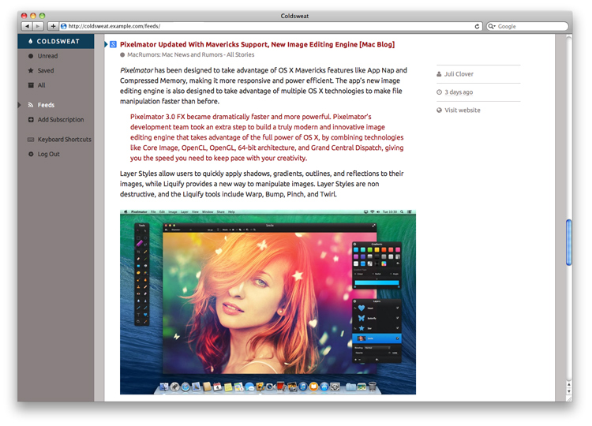

# Coldsweat

Coldsweat is a clean-room Python clone of the [Fever RSS aggregator][f], focusing on providing a compatible API and web feed reader. 

 

## Motivation

I'm fed up of online services that are here today and gone tomorrow. After the Google Reader shutdown is clear to me that the less we rely on external services the more the data we care about are preserved. With this in mind I'm writing Coldsweat. It will be my personal take at consuming feeds today. 

There will be blood.

## Features

* Multi-user support
* Compatible with existing Fever desktop and mobile clients
* Support for grouping of similar items
* Web interface to read and add feeds
* Multiprocessing for parallel feed fetching

## Current status

* Coldsweat correctly syncs read and saved items with [Reeder][r] for iOS and [ReadKit][rk] on OS X (see [issue #3][i3])
* A command-line utility is provided to bulk import and export feeds as an OPML files, create users and more (run `python sweat.py -h`)

## Setup

See _[setup]_ page.

## Upgrading from previous versions

Coldsweat 0.9.1 works with newer versions of Requests, WebOb and Peewee packages so you need to update those too. As usual run again `pip install -r requirements.txt`. 

## Technical underpinnings

* Uses the industry standard Mark Pilgrim's [Universal Feed Parser][fp]
* Is WSGI compatible - currently tested under CGI, FastCGI and Passenger environments
* Uses SQLite, PostgreSQL and MySQL databases - PostgreSQL is still untested but should work (see [issue #37][i37])

Coldsweat started in July 2013 as a fork of [Bottle Fever][b] by Rui Carmo. By now I revised most of the code and tested the feed fetcher code with hundreds of Atom and RSS feeds.

For more information about the Coldsweat feed fetcher see the _[fetcher features][ff]_ page.

[fp]: https://pypi.python.org/pypi/feedparser/
[f]: http://www.feedafever.com/
[s]: https://github.com/passiomatic/coldsweat
[b]: https://github.com/rcarmo/bottle-fever
[rk]: http://readkitapp.com/
[r]: http://reederapp.com/
[ff]: https://github.com/passiomatic/coldsweat/wiki/Fetcher-features
[setup]: https://github.com/passiomatic/coldsweat/wiki/Setup
[i37]: https://github.com/passiomatic/coldsweat/issues/37
[i3]: https://github.com/passiomatic/coldsweat/issues/3