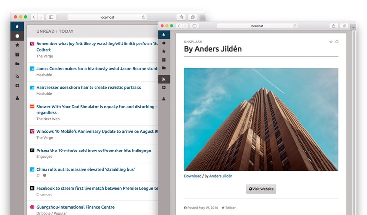

# Coldsweat

Coldsweat is a self-hosted Python 3 web RSS aggregator and reader compatible with the [Fever API][f]. 

This means that you can connect Coldsweat to a variety of clients like [Reeder][r] for iOS or Mac OS X [ReadKit][rk] app and use it to sync them together.

## Features

* ✅ Web interface to read and add feeds
* ✅ Compatible with existing Fever desktop and mobile clients
* ✅ Multi-user support
* ✅ Support for grouping of similar items
* TODO: Parallel feed fetching

## Setup

Download Coldsweat from PyPI using `pip`:

    $ pip install coldsweat

See _[setup]_ page for additional information.

## Upgrading from a previous version

Upgrade to the latest Coldsweat version with:

    $ pip install -U coldsweat

**Note**: there's no upgrade plan from previous 0.9.x releases. Your best best if to export OPML subscriptions and import them in the new 0.10 release.    

## 0.10 technical underpinnings

* Runs on Python 3.9 and up
* Completely rebuilt using Flask web framework
* Supports SQLite, PostgreSQL, and MySQL databases
* [HTTP-friendly fetcher][ff]
* Tested with latest versions of Chrome, Safari, and Firefox

## Motivation

I'm fed up of online services that are here today and gone tomorrow. Years ago, after the Google Reader shutdown it was clear to me that the less we rely on external services the more the data we care about are preserved. With this in mind I'm writing Coldsweat. It is my personal take at consuming feeds today.

Coldsweat started in July 2013 as a fork of [Bottle Fever][b] by Rui Carmo. After several years of pause I've restarted to develop Coldsweat using Python 3 and the latest crop of web technologies.

[fp]: https://pypi.python.org/pypi/feedparser/
[f]: http://www.feedafever.com/
[s]: https://github.com/passiomatic/coldsweat
[b]: https://github.com/rcarmo/bottle-fever
[rk]: https://readkitapp.com/
[r]: https://reederapp.com/
[ff]: https://github.com/passiomatic/coldsweat/wiki/Fetcher-features
[setup]: https://github.com/passiomatic/coldsweat/wiki/Setup